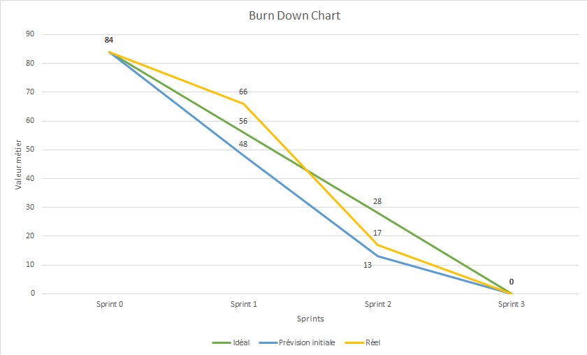

# Releases

## Release n°3

10/12/2019 + Sprint3.v0.1.0
Release : https://github.com/JSenjean/gr1_eq2_Release/releases

## Burn Down Chart

# User Stories achevées

| ID     | Description                                   | Difficulté | Priorité | Sprint |
|--------|-----------------------------------------------|------------|----------|--------|
| US11   | **En tant que** participant                   | 3          | HIGH     | 1      |
|        | **je peux** avoir une vue d'ensemble du projet depuis la page de gestion de projet, ce qui affiche les informations suivantes :
|        | - la liste des membres du projet
|        | - les demandes actuelles des utilisateurs pour rejoindre le groupe 
|        | - les invitations en attente, envoyées par le chef de projet aux utilisateurs
|        | - vue d'ensemble du sprint courant \(dates, tâches restantes\)
|        | - récapitulatif des tests \(% executé\)
|        | - le nom, la description et la visibilité du projet
|        | afin d'avoir une vue d'ensemble du projet
| US17   | **En tant que** participant                   | 5          | HIGH     | 2      |
|        | **je peux** cliquer sur un sprint, pour étendre son affichage et avoir accès à la liste des user stories correspondantes, des tâches à faire, des tâches en cours de réalisation, et des tâches terminées \(les tâches marquées comme terminées contribuent à augmenter le pourcentage d'accomplissement du sprint\)\. je peux également ajouter ou supprimer les user stories associées en cliquant sur les boutons correspondants
|        | **afin de** gérer en détail les tâches à réaliser durant le sprint
| US22   | **En tant que** chef de projet                | 3          | HIGH     |
|        | **je peux** ajouter un dépôt git de release dans la page de gestion de version \(ou page de release\)
|        | **afin de** rendre consultable l'historique des versions de release
| US23   | **En tant que** participant                   | 1          | HIGH     |
|        | **je peux** consulter la page de gestion de version
|        | **afin de** voir toutes les releases du projet
| US24   | **En tant que** participant                   | 3          | HIGH     |
|        | **je peux** ajouter/modifier une section de documentation sur la page dédiée en cliquant sur ajouter/modifier une documentation en renseignant :
|        | - Un nom
|        | - Une description
|        | - Une catégorie
|        | - \(Optionnel\) Un fichier \.md associé
|        | La date de dernière modification est affichée pour chaque élément de documentation\. Si la documentation n'a pas changé depuis 1, 2, 3 ou 4 semaines, l'élément dans la liste change de couleur \(vert, bleu, orange et rouge\)\.
|        | **afin de** indiquer qu'un élément de documentation est fait, et si il est ancien ou non \(et donc potentiellement obsolète\)
| US25   | **En tant que** participant                   | 3          | HIGH     |
|        | **je peux** ajouter/modifier/supprimer une catégorie de documentation sur la page dédiée en cliquant sur les boutons correspondants
|        | **afin de** organiser les différentes sections de documentation
| US26   | **En tant que** participant                   | 2          | HIGH     |
|        | **je peux** cliquer sur une section de documentation pour ouvrir le details ce qui permet de cliquer sur le bouton supprimer
|        | **afin de** supprimer de la liste les documentation obsolètes

# Tâches DONE correspondantes

| ID  | Nom                                         | Description                                                                                                                                                                                                                                                                                | Definition of Done                                                                                                               | Parents     | Coût (j/h) | Liaison US           | Développeur              | Etat  |
|-----|---------------------------------------------|--------------------------------------------------------------------------------------------------------------------------------------------------------------------------------------------------------------------------------------------------------------------------------------------|----------------------------------------------------------------------------------------------------------------------------------|-------------|------------|----------------------|--------------------------|-------|
| T1  | Docker                                      | Configurer Docker pour les releases du projet                                                                                                                                                                                                                                              | Pouvoir télécharger les sources du code et lancer un docker compose et vérifier le bon fonctionnement de l'application           | T0          | 1.5        | US1 - US29           | Guillaume                | DONE  |
| T2  | Travis                                      | Configurer Travis pour executer les tests a chaque push sur le dépot git de dev et de realease                                                                                                                                                                                             | Pouvoir configurer une automatisation des tests                                                                                  | T0          | 1.5        | US20 US21         | Guillaume                | DONE  |
| T3  | view/release.php                            | Créer l'affichage de la page dont : l'affichage des releases et de toutes les informations associées de GitHub                                                                                                                                                                             | Pouvoir se connecter et vérifier que la page comporte bien les dernières release de github                                       | T0          | 0.5        | US22 US23         | Mathieu                  | DONE  |
| T4  | model/release.php controller/release.php | Récupérer les informations des releases grâce a l'API Github pour pouvoir les afficher dans la page des releases                                                                                                                                                                           | Pouvoir se connecter et vérifier que la page comporte bien les dernières release de github                                       | T0          | 1          | US22 US23         | Mathieu                  | DONE  |
| T5  | view/doc.php                                | Créer l'affichage de la documentation que se construit d'une manière similaire à la page des tests : affiche les sections de doc, avec des informations et si elle est faite ou pas grâce à deux boutons, on peut aussi la rendre obsolète ainsi qu'upload des fichiers                    | Pouvoir se connecter et créer des sections de documentations et vérifier que l'on peut les rendre valide ou non et les supprimer | T0          | 0.5        | US24 US25 US26 | Guillaume                | DONE  |
| T6  | model/doc.php controller/doc.php         | Écrire model et controller permettant de créer des sections de documentation en renseignant son nom et sa description, créer les filtres d'affichage des sections, les boutons de passage et de suppression, une barre de progression représentant le pourcentage de documentation écrite. | Pouvoir se connecter et créer des sections de documentations et vérifier que l'on peut les rendre valide ou non et les supprimer | T0          | 0.5        | US24 US25 US26 | Guillaume                | DONE  |
| T7  | model/sprints.php controller/sprints.php | Ajouter la laison des US dans les sprints via le bouton "Ajouter User Story", et ajouter dans lla création et modification de task la liaison à une ou plusieurs userstory                                                                                                                 | Pouvoir se connecter et lier des User Stories à un sprint puis à une tâche                                                       | T0          | 1.5        | US17                 | Joël                     | DONE  |
| T8  | model/test.php controller/test.php       | Ajouter le changement d'état des tests en obsolète quand une nouvelle release est ajouté.                                                                                                                                                                                                  | Ajouter une release et vérifier que les tests deviennent obsolète                                                                | T0          | 0.5        | US21                 | Mathieu                  | DONE  |
| T12 | Documentation                               | Ecrire la doc des fonctions de model/                                                                                                                                                                                                                                                      | Pouvoir consulter la documentation des fonctions de model/                                                                       | T1 - T9     | 1          | US1 - US29           | Guillaume, Joël, Mathieu | DONE  |
| T13 | Manuels                                     | Ecrire les manuels utilisateur, administrateur et de test                                                                                                                                                                                                                                  | Pouvoir consulter les manuels utilisateur, administrateur et de test                                                             | T1 - T9     | 0.5        | US1 - US29           | Guillaume                | DONE  |

# User Stories reportées au sprint 2

Seules des tâches de tests n'ont pas été terminées. Les fonctionnalités métiers et leurs US associées ont été achevées.

# Tâches non achevées à la fin du sprint 3

| ID  | Nom                                                                                                                                                                                                                                                     | Description                                                                                                                                                                                                                                                                                                                                                                                                                                                                                                                                                                                                                                                                  | Definition of Done                                                                                                                                                                                                                                                                                                                                                                         | Parents | Coût (j/h) | Liaison US        | Développeur | Etat  | Maquette                                                           |
|-----|---------------------------------------------------------------------------------------------------------------------------------------------------------------------------------------------------------------------------------------------------------|------------------------------------------------------------------------------------------------------------------------------------------------------------------------------------------------------------------------------------------------------------------------------------------------------------------------------------------------------------------------------------------------------------------------------------------------------------------------------------------------------------------------------------------------------------------------------------------------------------------------------------------------------------------------------|--------------------------------------------------------------------------------------------------------------------------------------------------------------------------------------------------------------------------------------------------------------------------------------------------------------------------------------------------------------------------------------------|---------|------------|-------------------|-------------|-------|--------------------------------------------------------------------|
| T9  | tests unitaires de model/documentation      | Ecrire les tests unitaires pour tester toutes les fonctions de model/documentation.                                                                                                                                                                                                        | Pouvoir lancer les tests automatisés qui renvoient le succès ou l'échec du test de toutes les fonctions.                         | T5          | 0.5        | US1 - US29           |                          | TODO  |
| T10 | tests unitaires de model/release.php        | Ecrire les tests unitaires pour tester toutes les fonctions de model/documentation.                                                                                                                                                                                                        | Pouvoir lancer les tests automatisés qui renvoient le succès ou l'échec du test de toutes les fonctions.                         | T4          | 0.5        | US1 - US29           |                          | TODO  |
| T11 | tests_validation/                           | Ecrire les tests de validations pour les US 10 à 26                                                                                                                                                                                                                                        | Pouvoir lancer le script de test sur toutes les User Stories et consulter les résultats dans les logs                            | T1 - T9     | 1.5        | US10 - US27          | Guillaume                | DOING |